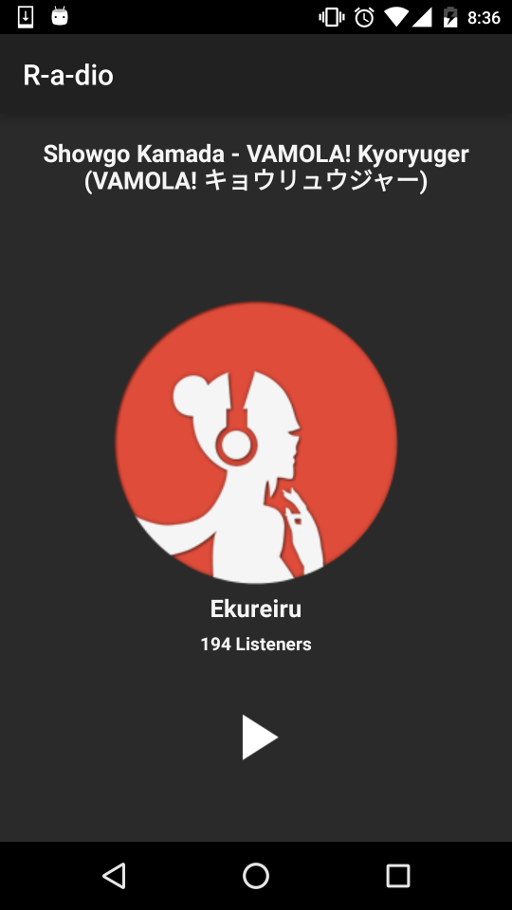

---

An Android application developed for [R-a-dio](http://r-a-d.io) &mdash; a website that plays a variety of Anime soundtracks and Japanese songs.

This app allows users to listen to their favourite Anime Radio from their pockets. It is a **work-in-progress** that currently includes a fully-functional radio player featuring a simple, aesthetically-pleasing user interface. From this interface, the user can control the player and see information such as the current track title, current DJ, and current number of listeners.

## Development Background

This project was created as a way to gain a better understanding of Android development and to further improve my software development skills as a whole.

One of the major goals of this project was to practice **Test-Driven Development** on Android. This includes the use of testing tools like **JUnit**, **Robolectric** and **Mockito**, as well as the use of design patterns that improve testability, such as the **Model-View-Presenter (MVP)** architectural pattern and the practice of using **dependency injection** to decouple dependencies. 

I also wanted to gain experience in using modern, proven libraries used by the Android community today, like **Dagger 2** and **Retrofit**. A full list of the libraries I've used is included below.
 
Finally, I created this project for my own personal enjoyment and to give myself a piece which I can iteratively and constantly improve for my own pleasure. 

## Screenshots

The app's radio player (aka the main user experience). 

Note that this project is still a work-in-progress. There are many user stories written to add features to the app, and so this UI will most likely change significantly in the coming months.

## Libraries Used
###### Audio/Media
- **ExoPlayer**: https://github.com/google/ExoPlayer

###### Dependency Injection
- **Dagger 2**: https://github.com/google/dagger
- **ButterKnife**: https://github.com/JakeWharton/butterknife

###### Network
- **Retrofit 2**: https://github.com/square/retrofit
- **Gson**: https://github.com/google/gson

###### Testing
- **Robolectric 3**: https://github.com/robolectric/robolectric
- **Mockito**: https://github.com/mockito/mockito
- **AssertJ**: https://github.com/square/assertj-android
